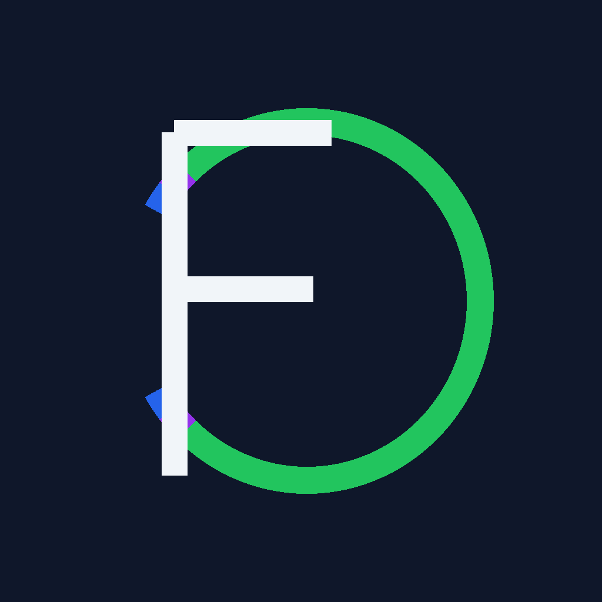

---

# 🎨 `clipflow-brand-kit` README.md

```markdown
<p align="center">
  
</p>

# ClipFlow Brand Kit

[](LICENSE)

Official **ClipFlow Brand Kit** with CF monogram logo, palettes, favicons, and banners.  
Balanced design — not too minimal, not too flashy.

---

## 📦 Included Assets
- Logos:
  - `logo_cf_light.svg` / `logo_cf_dark.svg`
  - `logo_cf_light.png` / `logo_cf_dark.png`
  - Monochrome: `logo_cf_black.png` / `logo_cf_white.png`
- Favicons:
  - `favicon-16.png`, `favicon-32.png`, `favicon-64.png`
- Banners:
  - `github_banner.png` (1200×400)
  - `social_preview.png` (1280×640)

---

## 🎨 Palette
| Name       | HEX      |
|------------|----------|
| Primary    | `#2563EB` |
| Secondary  | `#9333EA` |
| Accent     | `#22C55E` |
| Background | `#0F172A` |
| Text       | `#F1F5F9` |

---

## 📖 Documentation
- [Brand Guide](docs/BRAND_GUIDE.md) — usage rules, sizing, safe space  
- [Usage Examples](docs/USAGE.md) — how to embed logos in README, sites, favicons  
- [Palette JSON](docs/PALETTE.json) — machine-readable colors

---

## 📄 License
MIT License © 2025 [Rauf Alizada](https://github.com/raufA1)