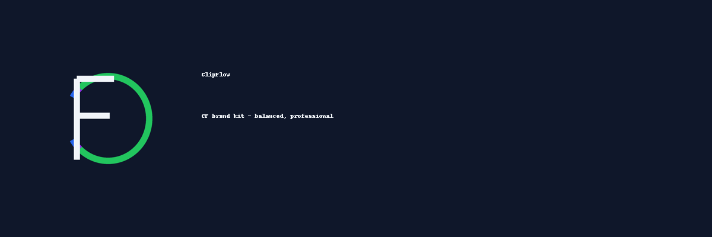

  

  
  
  
  
  
  

---

# 🎨 ClipFlow Brand Kit

**Official ClipFlow Brand Kit (CF monogram)** — logos, palettes, favicons, banners, and docs.

---

## 📂 Contents

- 🖼 Logos (light, dark, mono)  
- 🔳 Favicons (16px, 32px, 64px)  
- 🖥 Banners (GitHub, social preview)  
- 📑 Brand Guide + Usage + Palette JSON  

---

## 📚 Documentation

- [Brand Guide](docs/BRAND_GUIDE.md)  
- [Usage](docs/USAGE.md)  
- [Palette](docs/PALETTE.json)  

---

## 📜 License

MIT License © 2025 [raufA1](https://github.com/raufA1)
